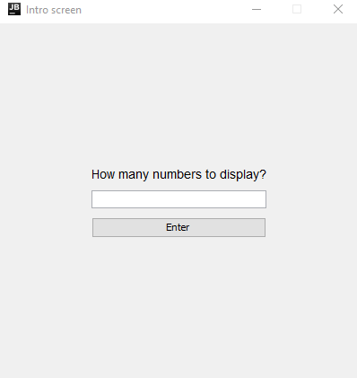
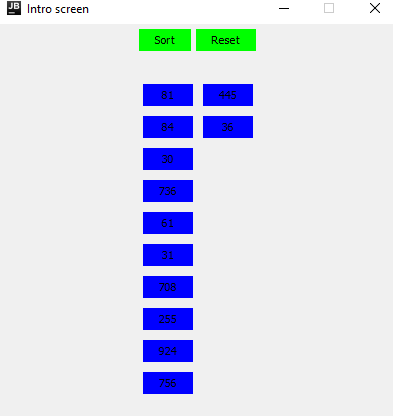

# 🛍️ Sorting Application 🌟

Welcome to the Sorting Application

Sorting application is an application that allows you to generate random numbers and sort them in ascending or descending order. A user-friendly tool designed to simplify the sorting process.

## ⚙️ Prerequisites

To set up and run the Sorting Application, ensure that your system has the following requirements:

- [Java 17](https://jdk.java.net/17/)
- [Gradle](https://gradle.org/install/) 7.x (7.5 or later) or 8.x

## 🚀 Installation

Follow these steps to install the Sorting Application:

1. Clone the repository:

    ```
    git clone git@github.com:vlad-platonov/sorting-app.git
    ```

2. Build the project using Gradle:

    ```
    gradle clean build
    ```

## 🎮 Running the Application

You can now run the Sorting Application by executing one of the following commands:

- Using the Gradle wrapper:

    ```
    ./gradlew run
    ```

- Directly through Gradle:

    ```
    gradle run
    ```

## 📜 Features

- Generate random numbers based on user input
- Sort numbers in ascending or descending order
- Update the screen after each iteration of quick-sort
- Reset and start over
- Special handling for numbers equal to or less than 30

## 🖥️ Screens

**Intro Screen**

- Enter a number and click "Enter" to generate random numbers
- 

**Sort Screen**

- Shows the generated random numbers
- Click "Sort" to sort the numbers in ascending or descending order
- Click "Reset" to go back to the intro screen
- Click a number button to generate new random numbers (if the number is equal to or less than 30) or show a message (if the number is more than 30)
- 
